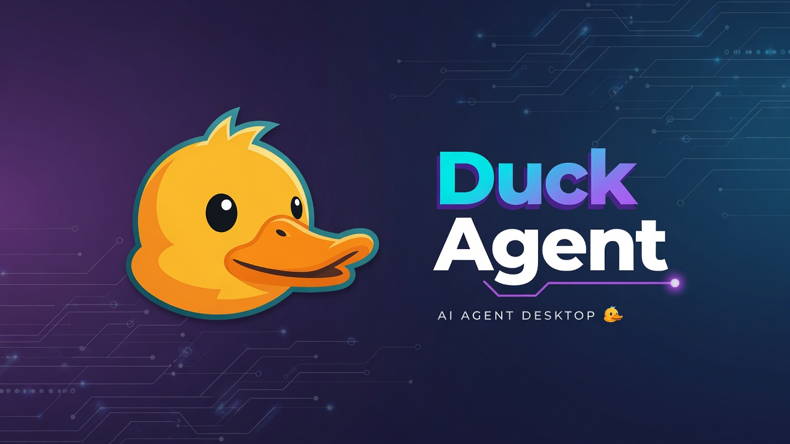

# Duck Agent

<p align="center">
  <a href="https://github.com/Franzferdinan51/Duck-Agent">
    
  </a>
</p>

<p align="center">
  <strong>A self-improving AI agent powered by Grok Build</strong>
</p>

<p align="center">
  <a href="https://github.com/Franzferdinan51/Duck-Agent/blob/main/LICENSE">
    
  </a>
  <a href="https://github.com/Franzferdinan51/Duck-Agent">
    
  </a>
</p>

Duck Agent is a powerful, self-improving AI agent desktop application built on the foundation of advanced agent technologies. It combines the best features from Hermes Agent's architecture with Prime Agent's recursive language model approach, all powered by Grok Build as the main harness.

## Key Features

- **Multi-Backend Support**: Choose between Grok Build (primary), Hermes-compatible, or Prime Agent backends
- **Grok Build Integration**: Native integration with Grok Build for advanced agent capabilities
- **Desktop Application**: Full-featured Electron desktop app with native OS integration
- **Self-Improving**: Agent that learns from experience and improves over time
- **Multi-Platform**: Runs on macOS, Windows, and Linux

## Architecture

Duck Agent is built with a modular architecture:

- **Desktop Shell**: Electron-based cross-platform desktop application
- **Agent Core**: Powered by Grok Build with support for alternative backends
- **Terminal Interface**: Full TUI with streaming, history, and slash commands
- **Plugin System**: Extensible via skills and MCP integrations

## Getting Started

### Prerequisites

- Node.js 22.22.0 or later
- npm or pnpm

### Installation

```bash
# Clone the repository
git clone https://github.com/Franzferdinan51/Duck-Agent.git
cd Duck-Agent

# Install dependencies
npm install

# Build the desktop app
cd apps/desktop
npm run build

# Run the app
npm start
```

### Development

```bash
cd apps/desktop
npm run dev
```

## Backend Selection

Duck Agent supports multiple backends:

1. **Grok Build** (Default): Primary harness with full Grok Build capabilities
2. **Hermes-Compatible**: Full Hermes Agent compatibility mode
3. **Prime Agent**: Prime Intellect's RLM-based agent system

Select your backend in Settings or via command line.

## Project Structure

```
Duck-Agent/
├── apps/
│   └── desktop/           # Electron desktop application
├── packages/              # Shared packages
│   └── shared/           # Shared components
├── agent/                # Agent core implementation
├── gateway/              # Communication gateway
├── tools/                # Built-in tools
├── skills/               # Agent skills
└── plugins/              # Plugin system
```

## License

MIT License - see [LICENSE](LICENSE) for details.

## Acknowledgments

- Built upon [Hermes Agent](https://github.com/nousresearch/hermes-agent) by Nous Research
- Inspired by [Prime Agent](https://github.com/PrimeIntellect-ai/prime-agent) by Prime Intellect
- Powered by [Grok Build](https://grok.com/build)
